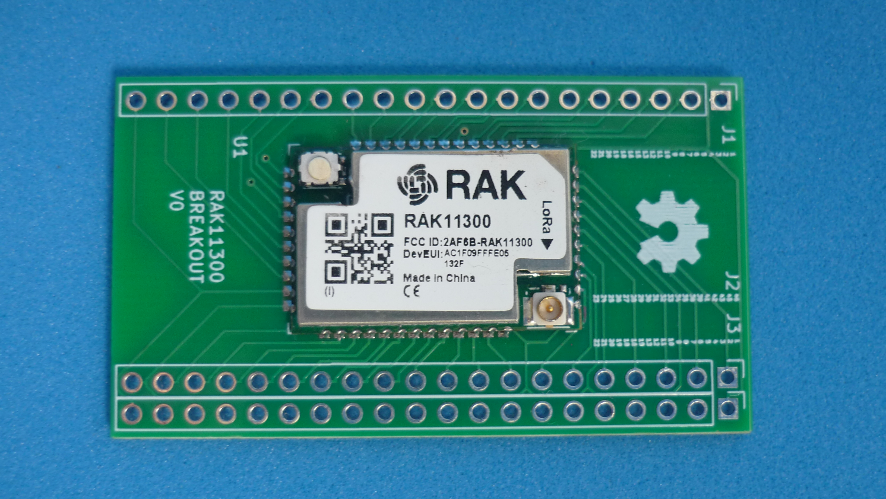
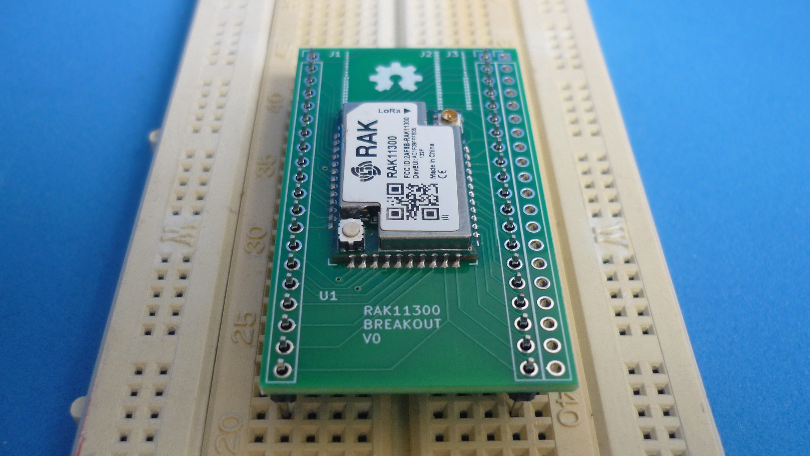
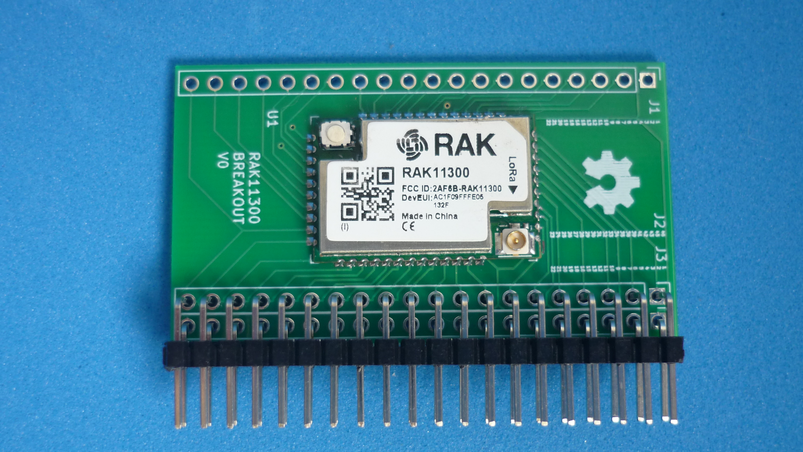
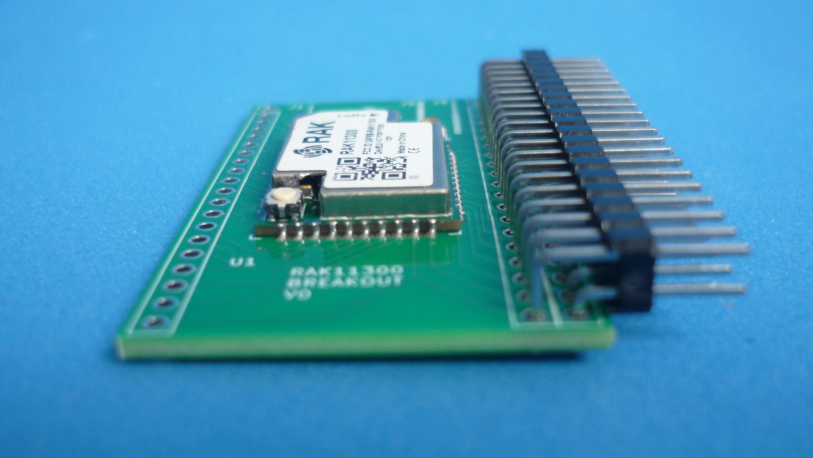
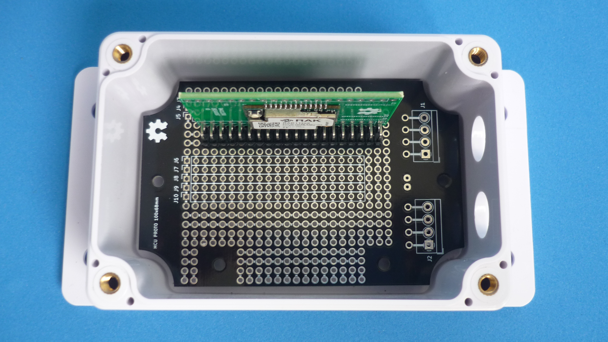
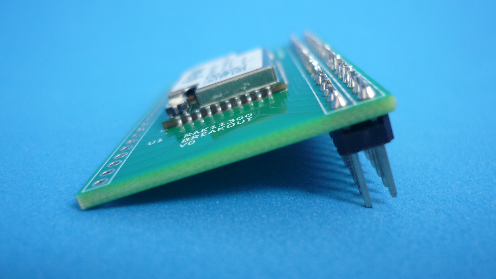
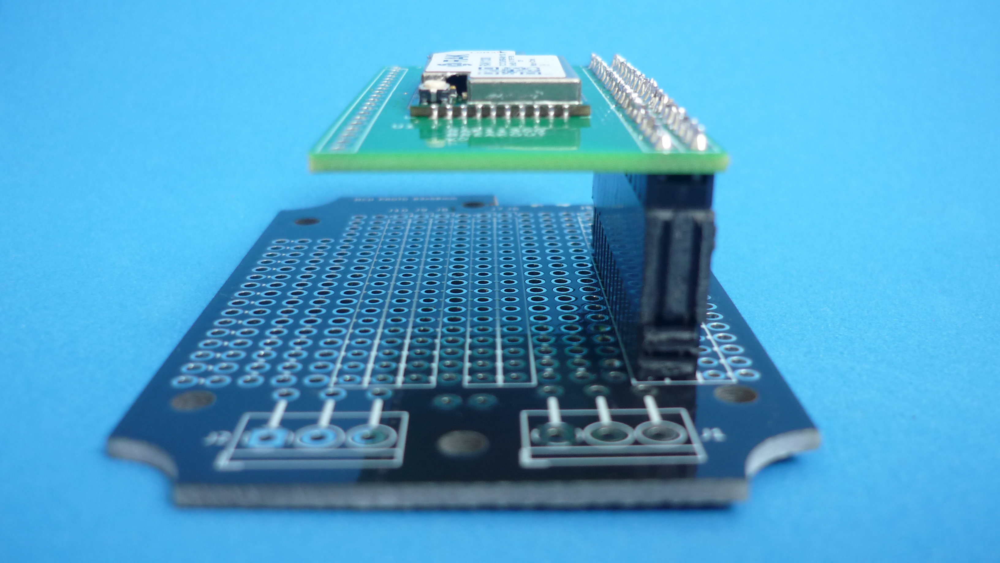
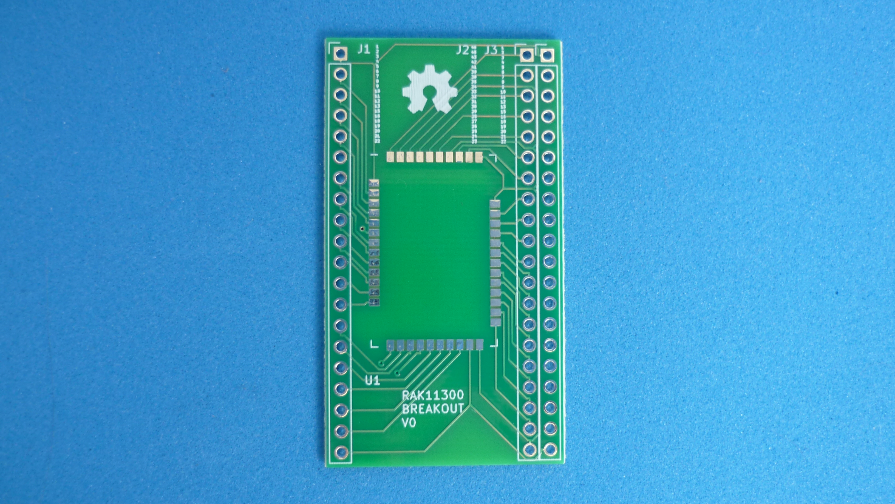
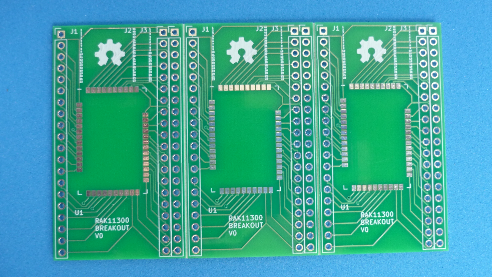

# BREAKOUT BOARD FOR RAK11300 MODULE

This board allows [RAK Wireless 11300 modules](assets/pdf/RAK11300.pdf) to be used on breadboard for prototyping. Open source and manufacturing files available. The main features are:

* Every pin is accessible
* Compatible with solderless breadboard
* Double row header for maximizing free space on prototype boards

## How to use this repository

The PCB was developed in KiCad V5.1,

## Directory structure

* The root folder contains template KiCad files: project, schematic and PCB 
* /library folder contains additional symbols needed to edit printed schematic
* /modules folder contains additional footprints needed to edit printed circuit board
* /gerber folder contains ready to manufacture files.
* /assets folder contains support files for reade.md

## PINOUT

## BREADBOARD

Pitch compatible with solderless breadboard

## DOUBLE ROW RIGHT ANGLE

Space saver option when enclosure's height allows it

 FRONT                             | SIDE                             | UPPER                            
-----------------------------------|----------------------------------|-----------------------------------
||

## DOUBLE ROW RISED

Space saver option for batteries or additional electronics. Uses long pin headers with spacers to reach the maximun allowable height

 SIDE                              | RISED                          
-----------------------------------|--------------------------------
|

## PCB

 SINGLE                            | PANEL                          
-----------------------------------|--------------------------------
|

