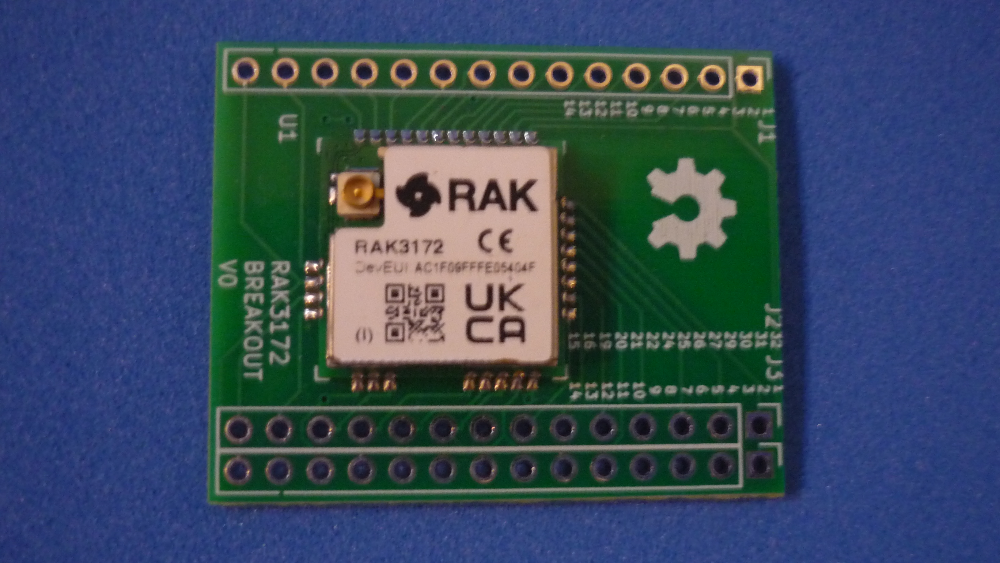

# BREAKOUT BOARD FOR RAK3172 MODULE

This board allow [RAK Wireless 3172 module](assets/pdf/RAK3172.pdf) to be used on breadboard for prototyping. Open source and manufacturing files available. the main features are:

* Every pin is accesible
* Compatible with solderless breadboard
* Double row header for maximizing free space on prototype boards

## How to use this repository

The PCB was developed in KiCad V5.1,

## Directory structure

* The root folder contains template KiCad files: project, schematic and PCB 
* /library folder contains additional symbols needed to edit printed schematic
* /modules folder contains additional footprints needed to edit printed circuit board
* /gerber folder contains ready to manufacture files.
* /assets folder contains support files for reade.md

## PINOUT

## BREADBOARD

Dual in-line package chip placed with 7.62 mm separation between pin rows

## SMALL MODULE

An example showing an Arduino nano with 15.24 mm separation between header rows

## BIG MODULE

An example showing a NODE MCU V3 with 27.94 mm separation between header rows.

## DOUBLE ROW HEADER MODULE

An example showing an RPI ZERO with 2x20 header with 2.54 mm separation between pins

## ADDITIONAL SPACE

Female headers used for easy reuse of the module, gives additional space for small components or modules.

Panelized PCB version 

